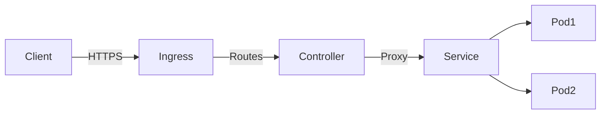

# Kubernetes Ingress 实战详解

> 预计阅读时间：9 分钟

## 1. 来源与演进
本文整理自 Kubernetes 官方文档、Ingress-NGINX 与 Traefik 社区的最佳实践，以及我们在多租户 API 网关迁移中的案例。重点关注 1.19+ Ingress V1 API 与 Gateway API 的关系，帮助团队在云原生架构中构建统一的北向入口。

## 2. 现状痛点
- **传统负载均衡器成本高**：每个服务申请一个 SLB，费用与管理成本难以接受。
- **多租户路由混乱**：同一集群中多个团队共享 Ingress 控制器，却缺少规范导致冲突。
- **安全策略分散**：限流、WAF、证书续签各自为政，排查困难。

## 3. Ingress 核心概念回顾
- **Ingress 对象**：声明路由规则、域名、TLS 证书等。
- **Ingress Controller**：具体实现，如 Ingress-NGINX、Traefik、HAProxy、ALB Controller。
- **Service / EndpointSlice**：Ingress Controller 通过 Service 找到后端 Pod。



## 4. 常见实现对比
| 控制器 | 优势 | 适用场景 |
| --- | --- | --- |
| **Ingress-NGINX** | 社区最广泛，特性成熟，支持自定义 Lua。 | 传统企业网关替换、需要细粒度配置 |
| **Traefik** | 配置简单，内置 Let’s Encrypt，原生支持 HTTP/3。 | 快速交付、混合云环境 |
| **AWS ALB** | 深度集成云平台，按需创建 ALB。 | 公有云重度用户 |
| **Kong Ingress** | 可扩展插件体系，支持认证、限流、日志。 | 需要 API 管理能力的团队 |

## 5. 关键配置详解
### 5.1 基础路由
```yaml
apiVersion: networking.k8s.io/v1
kind: Ingress
metadata:
  name: loan-api
  annotations:
    nginx.ingress.kubernetes.io/rewrite-target: /
spec:
  ingressClassName: nginx
  tls:
    - hosts:
        - api.loan.example.com
      secretName: loan-api-tls
  rules:
    - host: api.loan.example.com
      http:
        paths:
          - path: /v1/credit
            pathType: Prefix
            backend:
              service:
                name: credit-service
                port:
                  number: 8080
```

### 5.2 多租户隔离
- 通过 `ingressClassName` 将不同业务绑定到不同 Controller。
- 使用 `Namespace` + `NetworkPolicy` 限制访问面。
- 利用 `kubectl apply -f` + GitOps 控制流，避免手动操作带来的冲突。

### 5.3 安全强化
- **TLS 自动续签**：结合 cert-manager，配置 `ClusterIssuer`（ACME/企业 CA）。
- **WAF/限流**：Ingress-NGINX 提供 `limit-req`、`modsecurity`；Traefik 支持中间件链路。
- **零信任**：集成 OIDC 插件，实现基于用户身份的访问控制。

## 6. 与业务结合
在支付网关迁移项目中：
1. 统一入口域名 `pay.example.com`，根据路径将请求转发到 `order`、`settlement`、`notify` 服务。
2. 结合 Argo Rollouts 蓝绿发布，通过 Ingress 注解实现按百分比流量切换。
3. 配置 `IngressRoute` + `Middleware`，将合作方流量打上租户标签，并在 Prometheus 中监控成功率。

## 7. 进阶：向 Gateway API 演进
- Gateway API 将 Listener、Route 拆分为更细粒度对象，便于平台团队与业务团队分权。
- Ingress-NGINX 1.9+ 已支持 Gateway API Beta；可逐步引入 `GatewayClass` 统一管理。
- 推荐组合：平台团队维护 `Gateway`，业务团队提交 `HTTPRoute`，实现 GitOps 合作。

## 8. 常见故障排查清单
- `kubectl describe ingress` 查看事件，定位 404/503。
- `kubectl logs deploy/ingress-nginx-controller` 获取具体错误。
- 使用 `curl -H "Host: xxx" http://nodeip` 模拟请求。
- 借助 `kail`、`stern` 等工具实时跟踪日志。

## 9. 参考资料
- [Kubernetes Ingress API Reference](https://kubernetes.io/docs/concepts/services-networking/ingress/)
- [Ingress-NGINX User Guide](https://kubernetes.github.io/ingress-nginx/)
- [Gateway API 官网](https://gateway-api.sigs.k8s.io/)

通过标准化 Ingress 策略，可以在保证安全合规的同时，显著降低集群对外暴露成本，让业务团队专注于服务本身的演进。
