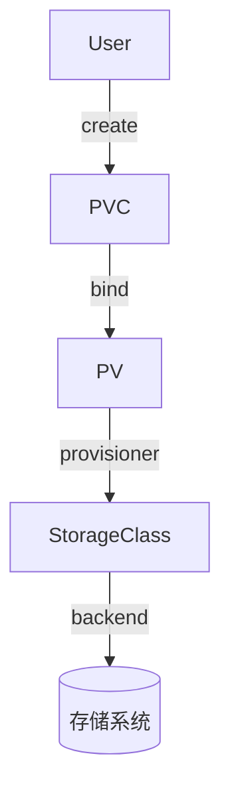

# Kubernetes 持久化存储：PV 与 PVC 全面解析

> 预计阅读时间：9 分钟

## 1. 来源与参考
结合官方存储卷文档、CNCF Storage WG 设计提案、Ceph/Rook、Longhorn 等开源存储项目的实践案例，总结在混合云集群中构建有状态服务存储的经验。

## 2. 当前挑战
- **多环境一致性**：开发、测试、生产集群的存储类型不同，导致 YAML 频繁改动。
- **容量与性能不可见**：缺少监控与配额策略，轻则影响稳定性，重则导致数据库宕机。
- **备份与恢复流程复杂**：无统一工具链，事故时难以快速恢复。

## 3. 核心概念回顾
- **PersistentVolume (PV)**：集群中的存储资源抽象，由管理员或动态供应器创建。
- **PersistentVolumeClaim (PVC)**：用户对存储的申请，指定容量、访问模式、存储类等。
- **StorageClass**：描述存储类型与供应器参数，实现动态供给。



## 4. 动态供给示例
```yaml
apiVersion: storage.k8s.io/v1
kind: StorageClass
metadata:
  name: fast-ssd
provisioner: kubernetes.io/aws-ebs
parameters:
  type: gp3
reclaimPolicy: Retain
allowVolumeExpansion: true
---
apiVersion: v1
kind: PersistentVolumeClaim
metadata:
  name: mysql-data
spec:
  accessModes:
    - ReadWriteOnce
  storageClassName: fast-ssd
  resources:
    requests:
      storage: 200Gi
```
- `allowVolumeExpansion` 允许在线扩容。
- `reclaimPolicy: Retain` 在删除 PVC 后保留数据，需手动清理。

## 5. 多租户存储策略
1. **命名空间级别配额**：通过 `ResourceQuota` 限制总存储申请。
2. **StorageClass 隔离**：不同业务线使用独立的 StorageClass，后台对应不同 Ceph Pool 或云磁盘类型。
3. **CSI 驱动权限控制**：为每个租户配置独立凭证，避免跨租户访问。

## 6. 数据保护与备份
- 集成 [Velero](https://velero.io) 实现增量备份与跨集群迁移。
- 对数据库类工作负载，结合 `VolumeSnapshot` 创建一致性快照。
- 通过 `CronJob` 调度，定期校验备份有效性。

## 7. 监控与运维
- 使用 Prometheus + Grafana 监控 PVC 使用率、IOPS、吞吐。
- 利用 `kubectl describe pvc`、`kubectl get pvc -A` 定期巡检绑定状态。
- 配置告警：当 PVC 使用率 > 80% 时提醒扩容。

## 8. 业务落地案例
在券商实时行情系统中：
- 使用 Rook 管理 Ceph 集群，定义 `replicated` 与 `erasure-coded` 两类 StorageClass。
- 将撮合服务的状态数据绑定至高性能 SSD，历史归档使用容量型存储。
- 借助 VolumeSnapshot 在升级前创建快照，若升级失败可快速回滚。

## 9. 常见故障排查
- PVC 长时间处于 `Pending`：检查 StorageClass 是否存在、CSI 控制器日志。
- Pod 无法挂载：查看节点 CSI 插件日志、确认节点权限。
- 数据未清理：对于 `Retain` 策略，需要手动删除底层存储卷。

## 10. 进一步阅读
- [Kubernetes Storage Concepts](https://kubernetes.io/docs/concepts/storage/)
- [CNCF Storage WG 白皮书]
- [Rook 官方文档]

通过标准化 PV/PVC 策略，团队能够在 Kubernetes 中稳定托管数据库、消息队列等有状态服务，支撑关键业务持续运行。
