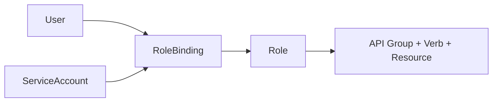

# Kubernetes RBAC 权限模型深度实践

> 预计阅读时间：8 分钟

## 1. 资料来源
基于 Kubernetes 官方安全指南、CIS Benchmark、阿里云/腾讯云托管集群最佳实践以及我们平台团队在打造多租户 DevOps 系统时的经验。

## 2. 现状与问题
- **默认管理员权限泛滥**：为省事直接赋予 `cluster-admin`，留下审计风险。
- **角色定义混乱**：命名不统一、规则重叠，难以维护。
- **审计缺乏**：谁在什么时候执行了什么操作，没有可追溯记录。

## 3. RBAC 基础概念
- **Role/ClusterRole**：定义操作权限集合，作用域分别是命名空间级与集群级。
- **RoleBinding/ClusterRoleBinding**：将角色绑定至用户、组或 ServiceAccount。
- **ServiceAccount**：Pod 内部调用 Kubernetes API 的身份。



## 4. 权限设计原则
1. **最小权限**：只授予完成任务所需的最小动作用例。
2. **职责分离**：将开发、运维、安全人员权限拆分，避免单点权限过大。
3. **可审计**：所有绑定通过代码管理，审计日志集中存储。

## 5. 实操示例
### 5.1 为业务团队创建命名空间角色
```yaml
apiVersion: rbac.authorization.k8s.io/v1
kind: Role
metadata:
  name: loan-dev-role
  namespace: loan-dev
rules:
  - apiGroups: [""]
    resources: ["pods", "services", "configmaps", "secrets"]
    verbs: ["get", "list", "watch", "create", "update", "patch", "delete"]
  - apiGroups: ["apps"]
    resources: ["deployments", "statefulsets"]
    verbs: ["get", "list", "watch", "create", "update", "patch", "delete"]
---
apiVersion: rbac.authorization.k8s.io/v1
kind: RoleBinding
metadata:
  name: loan-dev-binding
  namespace: loan-dev
subjects:
  - kind: Group
    name: dev-team
    apiGroup: rbac.authorization.k8s.io
roleRef:
  apiGroup: rbac.authorization.k8s.io
  kind: Role
  name: loan-dev-role
```

### 5.2 ServiceAccount 最佳实践
- 每个 Deployment 单独创建 ServiceAccount，避免共享。
- 配合 `kubectl create token` 或 `ProjectedServiceAccountToken`，限定有效期。
- 禁止在 Pod 中挂载默认 ServiceAccount，设置 `automountServiceAccountToken: false`。

### 5.3 审计与合规
- 开启 `apiserver` Audit Log，输出到 Elasticsearch + Kibana。
- 使用 Kubewarden/Kyverno 设定策略，禁止申请 cluster-admin。
- 定期运行 `kubectl auth can-i` 自动化测试权限。

## 6. 与业务结合
在多租户低代码平台中，我们：
- 为每个租户命名空间创建 `viewer`、`editor`、`ops` 三种角色，对应不同操作。
- 提供自助式权限申请流程，审批通过后自动生成 RoleBinding。
- 集成企业 IAM，登录后根据用户组动态生成 kubeconfig。

## 7. 常见故障排查
- “Forbidden” 错误：使用 `kubectl auth can-i` 检查用户是否具备权限。
- ServiceAccount 无法访问资源：确认 RoleBinding 是否指向正确命名空间。
- 审计日志太大：使用 Fluent Bit 过滤，仅保留关键事件。

## 8. 延伸阅读
- [CIS Kubernetes Benchmark]
- [Kubernetes Authorization Overview](https://kubernetes.io/docs/reference/access-authn-authz/authorization/)
- [Kyverno Policy Cookbook]

合理设计 RBAC，是实现多租户、合规与安全运营的基础，为企业的云原生平台保驾护航。
