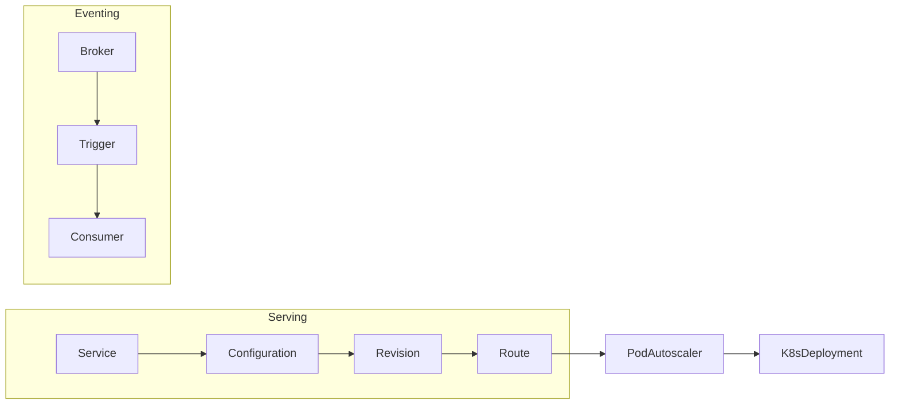

# Knative 驱动的企业级 Serverless 落地指南

> 预计阅读时间：10 分钟

## 1. 来源
文章参考了 Knative 官方文档、Google/VMware 的架构分享，以及我们在呼叫中心智能语音服务中从函数平台迁移到 Knative 的经验。

## 2. 市场现状
- 公有云 FaaS 在企业内部落地时常遇到 **数据主权** 与 **成本** 问题。
- 传统 PaaS 很难应对峰值突发，资源利用率低。
- 越来越多团队希望在 Kubernetes 上搭建自研 Serverless，统一运维与生态。

## 3. Knative 核心组件
- **Serving**：按需伸缩、流量治理、修订版本管理。
- **Eventing**：事件总线，支持 CloudEvents 标准与多种 Broker/Trigger。
- **Build**（已拆分）与 Tekton 等工具可用于 CI/CD。



## 4. 架构设计
- **资源规划**：为 Knative Serving 准备独立节点池，开启 `pod autoscaler` 的并发限制。
- **镜像构建**：通过 Tekton Pipeline + Kaniko 生成镜像，推送至 Harbor。
- **网络入口**：结合 Istio/Contour 作为网关，支持 mTLS。

## 5. 部署示例
```yaml
apiVersion: serving.knative.dev/v1
kind: Service
metadata:
  name: speech-text
  namespace: ai-platform
spec:
  template:
    metadata:
      annotations:
        autoscaling.knative.dev/class: kpa.autoscaling.knative.dev
        autoscaling.knative.dev/metric: concurrency
        autoscaling.knative.dev/target: "5"
        autoscaling.knative.dev/maxScale: "50"
    spec:
      containers:
        - image: registry.example.com/ai/speech-text:v2
          env:
            - name: MODEL_ENDPOINT
              value: http://model-serving:8080
  traffic:
    - latestRevision: true
      percent: 90
    - revisionName: speech-text-00018
      percent: 10
```
- **渐进式发布**：借助 `traffic` 字段完成灰度。
- **并发控制**：target=5 表示每个 Pod 最大处理 5 个并发请求。

## 6. 事件驱动实践
- 使用 CloudEvents 规范接入 CRM、语音识别等事件源。
- Eventing 结合 Kafka Broker，实现百万级事件吞吐。
- 通过 Trigger + CEL 表达式路由，实现差异化处理逻辑。

## 7. 成本与性能优化
- **冷启动优化**：利用 `queueProxy` 指标分析冷启动耗时，热点函数常驻运行；启用 `minScale` 确保核心服务无冷启动。
- **镜像瘦身**：采用 Distroless/Alpine，使用多阶段构建减小镜像体积。
- **自动扩缩容**：KPA 支持指标驱动伸缩，Autoscaler 与自研容量平台打通，实现业务高峰自动加容。

## 8. 业务结合案例
在智能语音外呼项目中：
1. 将原有的手工扩缩容服务迁移至 Knative，按并发自动伸缩，成本下降 30%。
2. 事件管道将通话结果推送到风控系统，触发后续贷款审批流程。
3. 借助 Tekton + Knative 实现模型版本的一键上线回滚。

## 9. 运维治理
- 使用 KEDA 监控 Kafka Lag，实现事件驱动伸缩。
- 集成 OpenTelemetry，追踪调用链路与冷启动耗时。
- 制定治理策略：限定每个命名空间的并发上限、防止滥用。

## 10. 进一步阅读
- [Knative Docs](https://knative.dev/docs/)
- [Knative Eventing Samples](https://github.com/knative/docs/tree/main/code-samples/eventing)
- [Google Cloud Blog: Knative in Production]

Knative 让企业既能享受 Serverless 的敏捷，又能掌控基础设施与数据，在数智化升级过程中提供弹性、高可用的执行环境。
