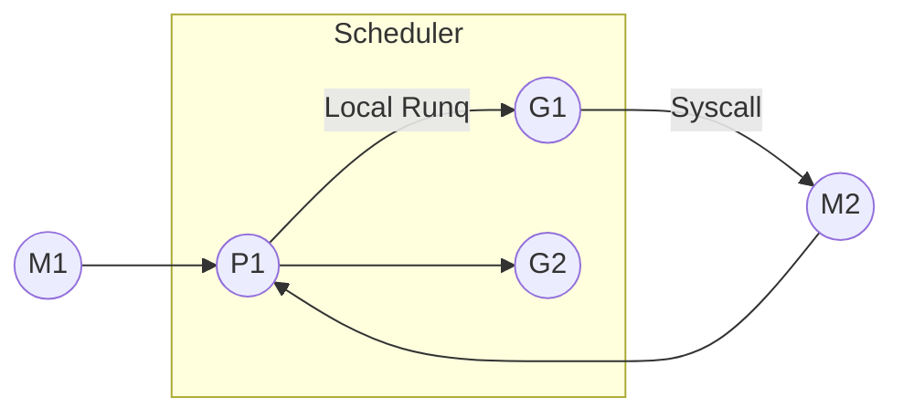

# Go 并发模式与调度深入解析

> 预计阅读时间：10 分钟

## 1. 背景与资料来源
文章梳理来自《The Go Programming Language》、Go 官方调度器演讲（GopherCon 2018）、Uber/Mercari 等公司的生产案例，以及我们团队在实时风控系统中对 Goroutine 泄露与调度阻塞的实战复盘。

## 2. 现状：协程友好但风险并存
- **调度可视化工具匮乏**：默认 `pprof` 难以呈现 Goroutine 的阻塞图谱，常需借助 async-profiler、Goroutine Dump 工具配合分析。
- **通道滥用**：在业务逻辑中随意堆砌 `chan` 导致死锁、内存涨幅不可控。
- **资源治理缺位**：未限制 Goroutine 数量，令高并发时后台任务暴涨，抢占核心业务线程。

## 3. 调度模型核心
Go 调度采用 M-P-G 模型：
- **M（Machine）** 映射操作系统线程。
- **P（Processor）** 代表逻辑处理器，负责运行队列。
- **G（Goroutine）** 为用户态协程。



了解该模型有助于解释以下问题：
- 为什么 `runtime.GOMAXPROCS` 决定并行度。
- Goroutine 在系统调用阻塞时如何被调度器“偷走”。
- 大量短生命周期 Goroutine 时，调度器如何通过 `work stealing` 均衡队列。

## 4. 常见并发模式
### 4.1 Worker Pool
```go
func worker(ctx context.Context, tasks <-chan Task, wg *sync.WaitGroup) {
    defer wg.Done()
    for {
        select {
        case <-ctx.Done():
            return
        case task, ok := <-tasks:
            if !ok {
                return
            }
            process(task)
        }
    }
}
```
**实战建议**：
- 限制 `tasks` 缓冲区大小，防止消费者堆积。
- 借助 `errgroup` 统一控制生命周期。

### 4.2 Pipeline
将复杂任务拆为多级管道，每级聚焦单一职责：
```go
type Result struct {
    Item  Item
    Err   error
}

func stageDecode(in <-chan []byte) <-chan Result {
    out := make(chan Result)
    go func() {
        defer close(out)
        for raw := range in {
            item, err := decode(raw)
            out <- Result{Item: item, Err: err}
        }
    }()
    return out
}
```
通过 pipeline 结合 backpressure，可在日志消费、实时指标归档等场景中保持流量平稳。

### 4.3 扇入/扇出（Fan-in/Fan-out）
使用 `select` 汇聚多个信道：
```go
func merge(ctx context.Context, cs ...<-chan Event) <-chan Event {
    out := make(chan Event)
    var wg sync.WaitGroup
    output := func(c <-chan Event) {
        defer wg.Done()
        for evt := range c {
            select {
            case <-ctx.Done():
                return
            case out <- evt:
            }
        }
    }
    wg.Add(len(cs))
    for _, c := range cs {
        go output(c)
    }
    go func() {
        wg.Wait()
        close(out)
    }()
    return out
}
```

## 5. 调度治理手册
1. **设定 Goroutine 上限**：利用 `semaphore` 控制后台任务并发度，防止流量洪峰拖垮核心服务。
2. **Trace + Metrics**：在业务关键路径埋点 `runtime/trace` 与 `expvar` 指标，结合 Prometheus 监控 Goroutine 数量、GC 停顿时间。
3. **Goroutine 泄露检测**：集成 `uber-go/goleak` 到单元测试，防止测试结束时仍有 Goroutine 存活。
4. **热点隔离**：对于 CPU 密集型任务，考虑 `worker` 绑定至独立 `P` 或使用 `runtime.LockOSThread`，与 IO 协程隔离。

## 6. 与业务场景结合
在实时风控中，我们通过以下方式优化：
- 将原先所有请求共享的 `chan` 改为分区队列，根据用户 ID 哈希分桶，减少锁竞争。
- 将风险决策服务拆分为“特征收集”、“模型推断”、“结果写回”三段 pipeline，结合 Kafka backpressure 保证稳定性。
- 使用 Grafana 展示 Goroutine 上下限、平均等待时长与拒绝率，让业务团队可以感知到风控服务的容量边界。

## 7. 进一步阅读
- [Go Scheduler Tracing](https://go.dev/blog/trace)
- [Uber Engineering: Channel Primitives](https://eng.uber.com/go-channels/)
- [GopherCon 2023: Practical Go Concurrency Patterns]

掌握调度原理与模式库，才能在复杂业务高峰期保障 Go 服务的稳定性与弹性扩展能力。
