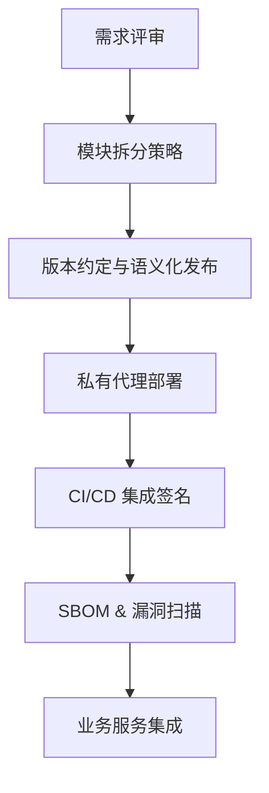

# Go 模块与依赖管理最佳实践

> 预计阅读时间：8 分钟

## 1. 来源与发展脉络
Go Modules 在 Go 1.11 正式进入实验阶段，1.13 起成为默认依赖管理方式，逐步替代了 `GOPATH` + `dep` 的组合。本篇参考了 Go 官方博客、Russ Cox 的模块设计提案，以及国内云原生社区对多模块仓库的落地经验，结合我们团队在构建金融级 API 平台时的踩坑记录。

## 2. 现状与常见痛点
- **多仓库碎片化**：大型组织往往有多个 Go 服务仓库，缺乏统一的依赖治理策略，导致相同 SDK 被拷贝多份。
- **私有依赖分发困难**：内网 Git 服务、制品库与模块代理需要协同，开发者常因证书或代理配置问题无法拉取依赖。
- **版本漂移**：团队成员不锁定 `go.sum` 或手动编辑导致的版本漂移，进一步触发不可复现的构建问题。
- **CI/CD 可追溯性弱**：缺少版本签名、SBOM（软件物料清单）时，很难回答“这个服务究竟引用了哪些三方组件”。

## 3. 为什么值得投入
将模块治理做扎实可以带来三方面收益：
1. **可重复构建**：通过 `go env GOPRIVATE`、`GONOSUMDB` 和内部镜像站，确保任何开发者或流水线都能稳定拉取依赖。
2. **安全合规**：结合 `govulncheck` 与 SBOM 报告，及时发现 CVE 并进行版本替换，满足金融或政企内控审计要求。
3. **组织效率**：统一的模块版本策略、CHANGELOG 规范与语义化版本发布，能让平台团队与业务团队协同更顺畅。

## 4. 工程实践蓝图


### 4.1 仓库布局与模块划分
- **单仓多模块**：适用于共享基础能力的场景，例如 `libs/logging`、`libs/metrics`、`services/order`. 使用 `go.work` 将多个模块在本地编排，避免频繁 `replace`。
- **多仓单模块**：面向独立交付团队；通过内部模块代理（如 Athens、goproxy.cn + 私有源）托管版本。
- **跨语言协作**：对外暴露 API 的模块可结合 OpenAPI/Buf Schema 自动生成多语言 SDK，避免重复造轮子。

### 4.2 版本发布流水线
```bash
# 1. 本地校验
make test lint

# 2. 更新版本号和变更日志
git tag v1.6.0
./scripts/update-changelog.sh v1.6.0

# 3. 推送并让 CI 生成制品
git push origin main --tags
```
CI 中建议加入：
- `go test ./...` 验证基础能力
- `go vet` + `staticcheck` 做静态分析
- `govulncheck` 输出漏洞报告
- 将最终产物推送至 Nexus/Artifactory，供私有代理拉取

### 4.3 私有依赖与代理配置
在企业内网可部署 **Goproxy + GONOSUMDB**：
```bash
export GOPRIVATE="git.corp.local/*"
export GONOSUMDB="git.corp.local/*"
export GOPROXY="https://goproxy.corp.local,direct"
```
同时在 CI 环境通过凭证管理器（Vault、KMS）注入 Token，避免在代码库中硬编码凭据。

## 5. 与业务场景结合
以在线贷款风控平台为例：
- **共用风控规则引擎 SDK** 拆成单独模块，核心逻辑由平台团队维护，业务条线只负责配置。
- **领域层 DSL** 使用 `replace` 指向本地路径进行联调，待验收后统一升级到稳定版本。
- **数据合规**：对接内部 CA 服务，为每次发布的模块二进制生成签名文件，方便上线审批。

## 6. 源码示例
```go
module git.corp.local/platform/rules-engine

go 1.21

require (
    github.com/google/uuid v1.5.0
    git.corp.local/platform/logkit v0.8.2
)

replace git.corp.local/platform/logkit => ../logkit
```
配合 `go.work`：
```go
use (
    ./rules-engine
    ./logkit
)
```
本地开发时可以同时调试多个模块；CI 则通过官方代理拉取已发布版本。

## 7. 结语与延伸阅读
- [Russ Cox: Go Modules 设计原理](https://research.swtch.com/vgo)
- [OpenSSF: SBOM 最佳实践](https://openssf.org)
- [Go 官方：私有模块常见问题](https://go.dev/doc/modules/private)

将依赖治理视作一项持续运营的能力，可以让 Go 服务在规模化演进时依旧保持简洁、可控。
