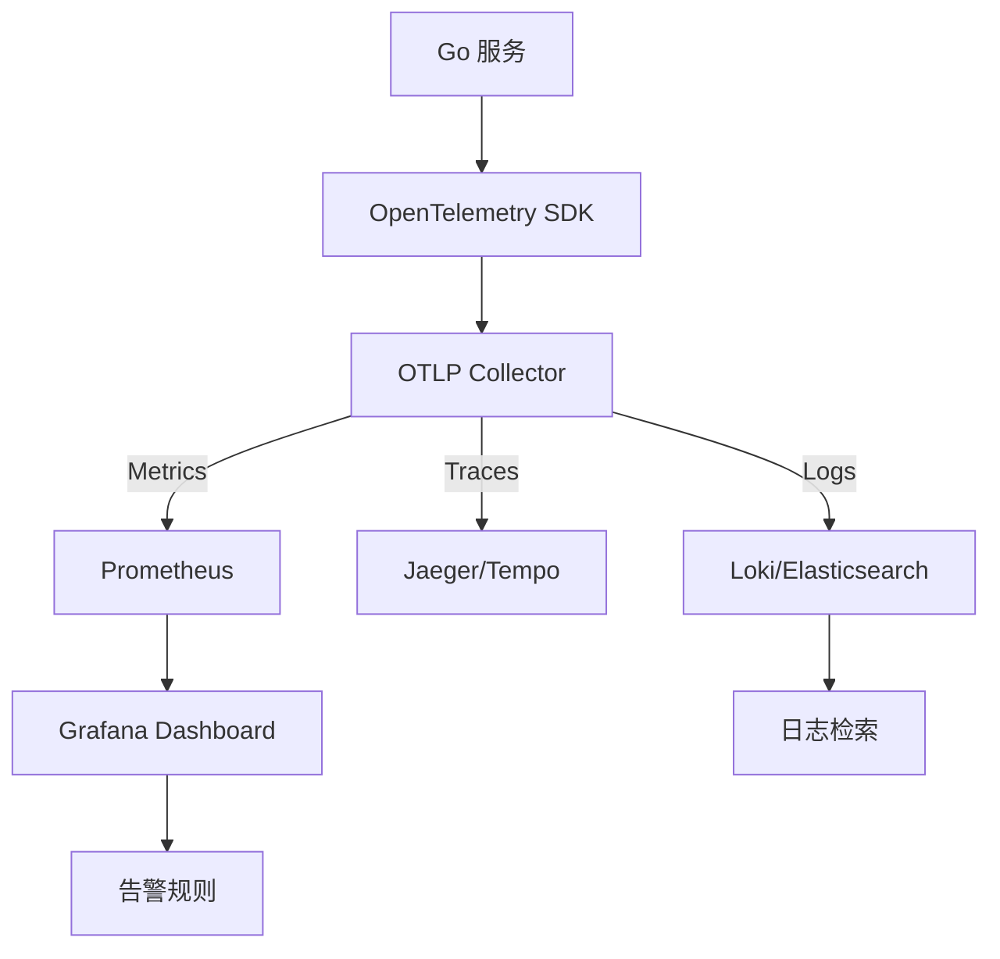

# Go 微服务的可观测性方案

> 预计阅读时间：8 分钟

## 1. 资料来源
结合 CNCF Observability WG 白皮书、OpenTelemetry 社区文档，以及我们在信用风控平台中建设四大中心（日志、指标、链路、事件）的实践经验。

## 2. 现状诊断
- **指标维度缺失**：很多 Go 服务仅暴露 HTTP 请求数量，难以反映业务结果。
- **日志割裂**：结构化日志标准不统一，导致跨团队排查时需要编写多个解析模板。
- **链路断裂**：调用外部依赖（如 Redis、Kafka）时常忘记透传 TraceID，导致链路分析断点。
- **治理闭环缺位**：监控指标触发告警后，缺乏自动化的升级、止血与事件复盘流程。

## 3. 架构蓝图


## 4. 实施步骤
### 4.1 指标治理
- 引入 `prometheus/client_golang`，以命名空间 + 子系统 + 指标名规范指标。例如 `loan_service_decision_latency_seconds`。
- 结合业务语义设计 `Histogram`，使用 `exemplar` 关联 TraceID。
- 通过 Recording Rules 计算 SLA、成功率、风控命中率等指标。

### 4.2 日志与事件
```go
logger := zerolog.New(os.Stdout).
    With().
    Timestamp().
    Str("service", "loan-decision").
    Logger()

logger.Info().
    Str("trace_id", traceID).
    Str("biz_order", orderID).
    Msg("decision success")
```
- 统一字段命名，强制业务 ID、TraceID、租户信息为必填。
- 搭建 Loki + Grafana Explore，提供跨服务检索模板。
- 将关键事件同步写入事件中心，供 SRE 与业务方复盘。

### 4.3 链路追踪
- 使用 `go.opentelemetry.io/otel` 中的自动化 instrument（HTTP、GRPC、database/sql）。
- 对内部 SDK 封装中间件，确保 TraceContext 透传。
- 利用 `tail-based sampling` 对异常请求保留完整链路，节约存储成本。

### 4.4 告警与自动化响应
- 在 Grafana 中配置基于 SLO 的多窗口、多阈值告警，降低报警噪音。
- 告警落地到 On-call 平台，并自动生成工单。
- 集成 Runbook，指导值班同学快速定位问题。

## 5. 业务结合案例
在信贷审批系统中：
- 通过指标观察到 “命中率异常下降”，结合链路追踪定位到外部征信接口超时。
- 自动化响应触发金丝雀回滚，恢复流量至上一版本 SDK。
- 复盘时根据日志中的租户信息，追溯到只有特定渠道受影响，据此优化缓存策略。

## 6. 源码参考
- [OpenTelemetry Go SDK 示例](https://github.com/open-telemetry/opentelemetry-go)
- [Grafana Agent Flow 方案]
- [Linkerd + OpenTelemetry 集成文档]

## 7. 总结
可观测性并非简单接入指标，而是以数据驱动业务稳定性改进的闭环。Go 服务借助轻量级运行时和丰富的中间件生态，可以在保持性能的同时，构建覆盖开发、测试、生产的统一可观测体系。
