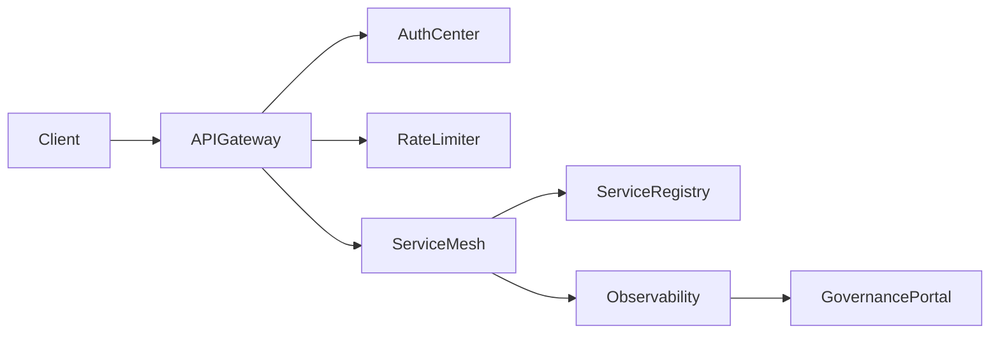

# 微服务治理与网关架构全景

> 预计阅读时间：9 分钟

## 1. 资料来源
参考 Netflix、蚂蚁金服与滴滴的服务治理分享，结合 CNCF Service Mesh 文档，以及我们在支付清结算平台建设统一网关与治理中心的经验。

## 2. 现状与挑战
- **入口混乱**：多个网关共存，鉴权、限流策略重复维护。
- **服务发现割裂**：REST、gRPC、MQTT 不同协议各自实现注册中心，导致拓扑不可视。
- **治理策略缺乏闭环**：熔断、限流策略配置后缺少监控验证。

## 3. 治理全景图


## 4. 核心能力拆解
1. **统一入口**：API Gateway（Kong, APISIX, Spring Cloud Gateway）负责协议适配、鉴权、灰度。
2. **服务注册发现**：使用 Nacos/Consul/Etcd，结合 Sidecar 或 SDK 模式。
3. **流量治理**：熔断、限流、降级、重试策略统一管控，支持可视化配置。
4. **配置中心**：动态下发规则，支持灰度发布与回滚。
5. **安全合规**：集成 WAF、数据脱敏、审计日志。

## 5. 架构落地步骤
### 5.1 梳理入口策略
- 接管所有外部调用，划分“公开 API”“合作方 API”“内部 API”。
- 针对合作方引入签名校验、IP 白名单。

### 5.2 网关与服务网格协同
- 网关负责南北向流量，Service Mesh（Istio/Linkerd）负责东西向治理。
- 在网关处注入 TraceID，Mesh 透传，实现端到端链路。
- Mesh 提供细粒度熔断与流量镜像能力。

### 5.3 策略编排与监控
- 建立治理门户，支持蓝图配置与审批。
- 引入 Prometheus + Grafana 监控治理策略命中率、熔断次数。
- 与业务指标联动，判断治理策略是否影响关键 KPI。

## 6. 业务实践案例
在支付清结算平台：
- 使用 APISIX + etcd 构建统一网关，提供 JWT 鉴权与限流。
- 使用 Istio 连接内部服务，实现多版本灰度发布。
- 构建治理中台，支持策略模板化复用，运营人员无需修改配置文件。

## 7. 源码示例
以 Kong 为例配置限流与金丝雀：
```bash
curl -X POST http://kong-admin:8001/services \
  --data name=settlement \
  --data url=http://settlement.svc.cluster.local:8080

curl -X POST http://kong-admin:8001/services/settlement/routes \
  --data name=settlement-route \
  --data "paths[]=/settlement" \
  --data strip_path=false

curl -X POST http://kong-admin:8001/services/settlement/plugins \
  --data name=rate-limiting \
  --data config.minute=600 \
  --data config.policy=redis
```

## 8. 未来演进
- 引入 Gateway API，支持多团队协作。
- 结合 Open Policy Agent 实现细粒度访问控制。
- 将治理策略纳入 GitOps 流程，实现审计与回滚。

## 9. 参考资料
- [Netflix: Microservices @ Scale]
- [Apache APISIX 文档]
- [Istio Traffic Management Guide]

通过构建统一的微服务治理体系，可以提升平台稳定性，增强对业务风险的可控能力，并让团队更快响应市场变化。
