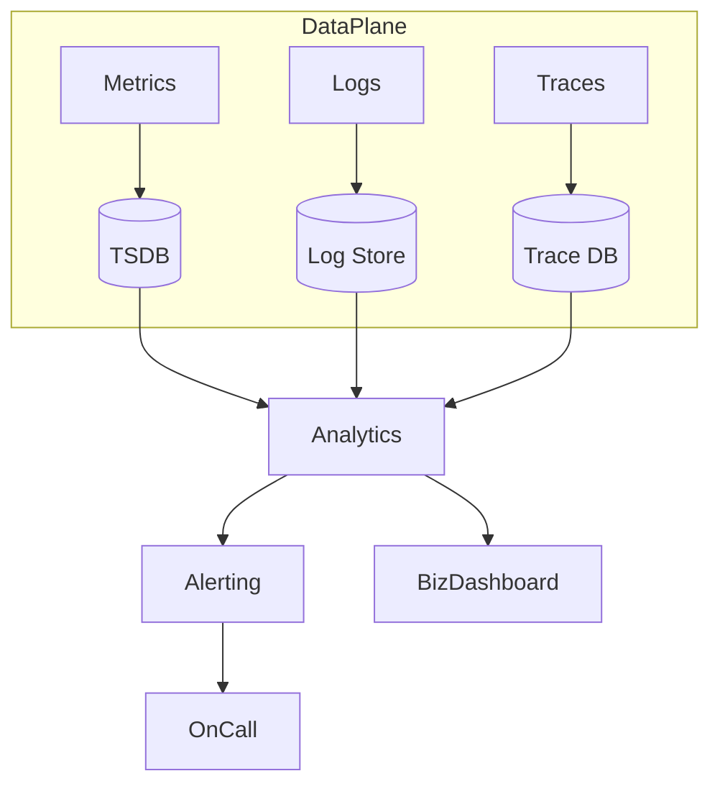

# 微服务可观测性体系构建指南

> 预计阅读时间：9 分钟

## 1. 背景资料
参考 CNCF 《Observability Landscape》、Google SRE 实战案例以及我们在互联网金融风控系统搭建“三位一体”观测平台（指标、日志、链路）的实践。

## 2. 现状分析
- **监控指标碎片化**：各业务线自建 Prometheus，指标命名不统一。
- **日志无法关联业务**：缺少 TraceID、用户信息，排查耗时。
- **链路追踪覆盖率低**：仅覆盖入口服务，内部调用缺失上下文。
- **数据孤岛**：指标、日志、告警、工单不互通。

## 3. 目标蓝图

## 4. 建设步骤
### 4.1 指标标准化
- 制定命名规范：`<domain>_<service>_<metric>_{unit}`。
- 引入 Exporter 工厂，自动为服务添加基础指标。
- 通过 Recording Rule 统一计算 SLA、错误率。

### 4.2 日志结构化
- 统一使用 JSON 日志，字段包括 `timestamp`、`level`、`trace_id`、`biz_key`。
- 使用 Fluent Bit + Loki/Elasticsearch 收集，支持多租户隔离。
- 对关键业务事件生成审计日志。

### 4.3 链路追踪全面覆盖
- 服务端统一使用 OpenTelemetry SDK，自动接入 HTTP/gRPC 数据库调用。
- 对消息中间件（Kafka/RabbitMQ）封装生产/消费中间件，透传 TraceContext。
- 配置 Tail-based Sampling，聚焦异常链路。

### 4.4 告警与事件闭环
- 以 SLO 为中心设计多窗口告警：短窗口检测突发，长窗口保证总体体验。
- 告警通过 Webhook 推送到 On-call 平台，自动生成工单。
- 复盘时结合链路、日志、指标自动生成报告。

## 5. 业务结合案例
在实时贷前审批场景：
- 指标平台展示每个通道的延迟分布，一旦超阈值触发自动降级策略。
- 日志平台支持按用户身份证号查询全链路日志，人工核查效率提升 60%。
- 链路追踪帮助定位到外部征信服务超时，引导合作方扩容。

## 6. 源码与工具
- [OpenTelemetry Collector Helm Chart]
- [Grafana Mimir/Loki/Tempo Stack]
- [Alertmanager Configuration Cookbook]

## 7. 常见问题与解法
- **指标爆炸**：限制高基数标签，设置 `allow_list`。对可疑指标运行 Cardinality 报告。
- **日志成本过高**：按业务价值定义日志留存策略，设置冷热数据分层。
- **链路数据丢失**：检查采样器配置、Collector 队列长度，必要时启用持久化队列。

## 8. 展望
下一步可以引入异常检测算法，实现 AIOps；结合业务 KPI 做根因分析，形成全栈观测与自动化运维闭环。
